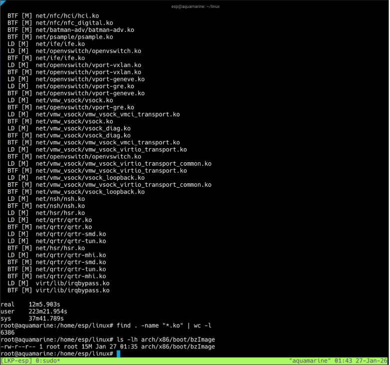

## 4.1 Kernel Naming
**LOCALVERSION value:** -<YourPID>-LKP26
**Method used:** 
- [*] menuconfig: General setup -> Local version
- [ ] Direct .config edit: CONFIG_LOCALVERSION="-xxx-LKP26"
**Command/steps:**

```
$ make defconfig
```

```
$ make menuconfig
```

I set the debug configurations here using slash('/') to search.


```
$ tmux new -s LKP-esp
```

```
$ time make -j$(nproc)
```

```
$ make modules_install && make modules
```

## 4.2 Debug Configuration
| Option | Explanation |
|-----------------------------|------------------------------------|
| CONFIG_DEBUG_INFO_DWARF5 | It generates modern debugging information (DWARF version 5). DWARF5 is |
| CONFIG_GDB_SCRIPTS |This builds helper scripts specifically for GDB. |
| CONFIG_FRAME_POINTER | <1-2 sentences> |
| CONFIG_MAGIC_SYSRQ | <1-2 sentences> |
| CONFIG_RANDOMIZE_BASE (off) | <1-2 sentences> |

## 4.3 Build Metrics
**tmux session name:** LKP-esp

**Build timing:**
- real: 12m5.903s
- user: 223m21.954s
- sys: 37m41.789s
**Kernel image size:**
- bzImage: 15 MB (from ls -lh arch/x86/boot/bzImage)
**Module count:**
- Total .ko files: 6386 (from find . -name "*.ko" | wc -l)
**Screenshot:** tmux-build.png (attached)


## 4.4 Install and Verify
**uname -a output:**

```
Linux aquamarine 6.18.0-esp-LKP26 #1 SMP PREEMPT_DYNAMIC Tue Jan 27 01:35:02 UTC 2026 x86_64 x86_64 x86_64 GNU/Linux
```

**Verification checklist:**
- [*] Version shows 6.18.0
- [*] LOCALVERSION shows -<YourPID>-LKP26
- [*] SMP indicates multi-processor support
**Screenshot:** kernel-booted.png (attached)


