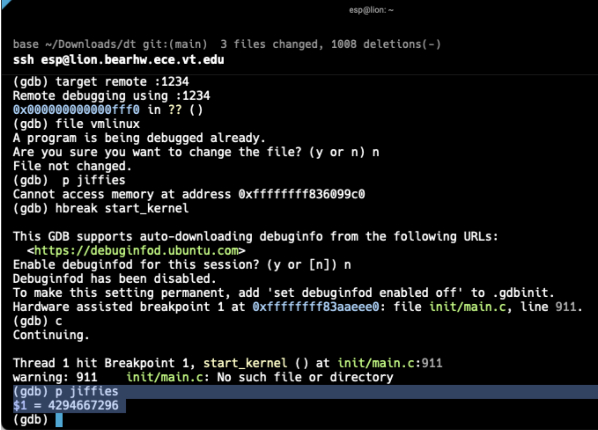

## 6.1 GDB Connection

**FEMU launch command:**

qemu-system-x86_64 -accel kvm -s -cpu host -m 256G -smp 32 -name td-plain,process=td-plain -object memory-backend-ram,id=mem0,size=256G -machine q35,memory-backend=mem0 -bios /usr/share/ovmf/OVMF.fd -nographic -nodefaults -device virtio-net-pci,netdev=nic0 -netdev user,id=nic0,hostfwd=tcp::10023-:22 -drive file=/path/to/image.qcow2,if=none,id=disk0 -device virtio-blk-pci,drive=disk0 -pidfile /tmp/tdx-demo-plain-pid.pid -daemonize -device vhost-vsock-pci,guest-cid=3

**GDB session:**

$ gdb vmlinux

(gdb) target remote :1234

Remote debugging using :1234

0xffffffff8104XXXX in native_safe_halt ()

(gdb) p jiffies

$1 = 4294667296

**Symbol verification:** SUCCESS (jiffies printed a number)

**Screenshot:** 
gdb-screenshot.png (attached)

## 6.2 Kernel State Examination

**Q1: init_task.comm**

(gdb) p init_task.comm

$1 = "swapper\000\000\000\000\000\000\000\000"

Explanation: PID 0 is the idle task (also called "swapper"). It is the first process created during boot. It runs only when the CPU is free (has nothing else to do).

**Q2: init_task.mm**

(gdb) p init_task.mm

$2 = (struct mm_struct *) 0x0

Explanation: The value is NULL (0x0). This is because init_task is a kernel thread, not a user program. It only runs in kernel space, so it does not need a user memory map (mm_struct).

**Q3: Thread count**

(gdb) info threads

Number of threads: 32

**Q4-6: Breakpoint on getpid**

(gdb) break __x64_sys_getpid

Breakpoint 1 at 0xffffffff81391c50

[In VM terminal: echo $$]

Breakpoint 1, __x64_sys_getpid (...)

(gdb) p current->comm

$3 = "\377\377\377\377", '\000' <repeats 11 times>

(gdb) p current->pid

$4 = 2105076232
